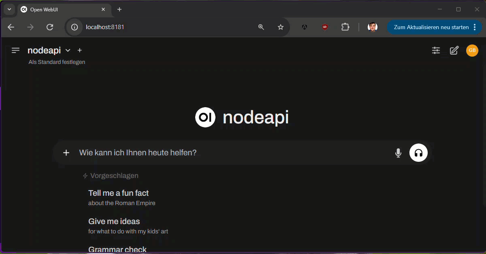

# **🚀 OllamaApiFacadeJS - For Express.js with LangChainJS**

**OllamaApiFacadeJS** is an open-source **Node.js** library designed to seamlessly integrate an **Express.js backend** with the **Ollama API** using **LangChainJS**. This allows clients expecting an Ollama-compatible backend - such as [Open WebUI](https://github.com/open-webui/open-webui) - to interact with your **Express.js API** effortlessly.

It serves as a **Node.js counterpart** to the [**.NET-based OllamaApiFacade**](https://github.com/GregorBiswanger/OllamaApiFacade), providing a similar level of integration but optimized for the JavaScript/TypeScript ecosystem.



## **✨ Features**

✅ **Ollama-Compatible API for Express.js** – Easily expose your Express backend as an Ollama API.  
✅ **Supports Local AI Models (e.g., LM Studio)** – Works with local inference engines like **LM Studio**.  
✅ **Seamless Integration with LangChainJS** – Enables natural language processing with LangChainJS.  
✅ **Automatic Function Calling Support** – **New:** Automatically executes tools (function calling) with `ToolCallService`.  
✅ **Streaming Support** – Stream AI-generated responses directly to clients.  
✅ **Custom Model Names** – Configure custom model names for full flexibility.  
✅ **Optimized for TypeScript** – Includes full TypeScript support (`.d.ts` files) for better IntelliSense.

## **📦 Installation**

You can install OllamaApiFacadeJS via NPM or PNPM:

```sh
pnpm add ollama-api-facade-js
```

or

```sh
npm install ollama-api-facade-js
```

## **🛠 Getting Started**

### **1️⃣ Prerequisites**

- **Node.js 18+**
- **Express.js**
- **LangChainJS**
- **LM Studio or another local LLM provider** (optional)

### **2️⃣ Basic Express.js Example**

Here’s how to integrate OllamaApiFacadeJS into an **Express.js application**:

```ts
import express from 'express';
import { ChatOpenAI } from '@langchain/openai';
import { createOllamaApiFacade, createLMStudioConfig } from 'ollama-api-facade-js';

const chatOpenAI = new ChatOpenAI(createLMStudioConfig());

const app = express();
const ollamaApi = createOllamaApiFacade(app, chatOpenAI);

ollamaApi.postApiChat(async (chatRequest, chatModel, chatResponse) => {
  chatRequest.addSystemMessage(
    `You are a fun, slightly drunk coding buddy. 
    You joke around but still give correct and helpful programming advice. 
    Your tone is informal, chaotic, and enthusiastic—like a tipsy friend debugging at 2 AM. Cheers!`
  );

  const result = await chatModel.invoke(chatRequest.messages);
  chatResponse.asStream(result);
});

ollamaApi.listen();
```

📌 **What does this setup do?**

- **Creates an Express.js server.**
- **Initializes the Ollama API facade using LangChainJS.**
- **Handles AI chat requests with streaming responses.**
- **Starts the server on `http://localhost:11434` (default Ollama port).**

## **🚀 Automatic Function Calling with `ToolCallService`**

Normally, when using **LangChainJS Function Calling**, you need to:

1. **Bind tools manually (`bindTools([...])`)**.
2. **Check the response for `tool_calls`**.
3. **Execute the appropriate tool(s)**.
4. **Re-send the updated message history to the model**.

**OllamaApiFacadeJS simplifies this with `ToolCallService`, handling everything for you!**

### **🚀 Example with `ToolCallService`**

```ts
import express from 'express';
import { ChatOpenAI } from '@langchain/openai';
import { createOllamaApiFacade, createLMStudioConfig } from 'ollama-api-facade-js';
import { dateTimeTool } from './tools/dateTimeTool';

const chatOpenAI = new ChatOpenAI(createLMStudioConfig());
const tools = [dateTimeTool];

const app = express();
const ollamaApi = createOllamaApiFacade(app, chatOpenAI);

ollamaApi.postApiChat(async (chatRequest, chatModel, chatResponse, toolCallService) => {
  chatRequest.addSystemMessage(`You are a helpful Devbot. 
    You have a dateTimeTool registered, execute it when asked about the time / date / day.
    `);

  const response = await toolCallService.with(tools).invoke(chatRequest.messages);

  chatResponse.asStream(response);
});

ollamaApi.listen();
```

📌 **What happens under the hood?**

- **`ToolCallService` automatically binds the tools**.
- **If the model requests a tool, it gets executed immediately**.
- **The response is updated and re-sent to the model if needed**.
- **You don’t need to manually handle `tool_calls` anymore!**

## **📡 Running Open WebUI with Docker**

After setting up your **Express.js backend**, you can integrate it with **Open WebUI** by running:

```sh
docker run -d -p 8181:8080 --add-host=host.docker.internal:host-gateway --name open-webui ghcr.io/open-webui/open-webui:main
```

➡ Open WebUI will now be accessible at:  
**<http://localhost:8181>**

For advanced configurations (e.g., GPU support), refer to the official [Open WebUI GitHub repo](https://github.com/open-webui/open-webui).

## **🏷️ Customizing Model Names**

By default, the API uses the model name `"nodeapi"`. To specify a **custom model name**, pass it as an argument:

```ts
const ollamaApi = createOllamaApiFacade(app, chatOpenAI, 'my-custom-model');
```

## **📡 Streaming AI Responses**

OllamaApiFacadeJS supports **streaming responses** to **improve response times** and **user experience**:

```ts
ollamaApi.postApiChat(async (chatRequest, chatModel, chatResponse) => {
  const result = await chatModel.stream(chatRequest.messages);
  chatResponse.asStream(result); // Handles both streams & single responses
});
```

💡 **Automatically detects whether streaming is supported** and adapts accordingly.

### Debugging HTTP Communication with `https-proxy-agent` 🐞

To analyze the HTTP communication between **LangChainJS** and language model APIs, you can use a proxy tool like **Burp Suite Community Edition** or **OWASP ZAP**. This allows you to inspect the exchanged data in detail.

#### 🔧 Setup

1. Install `https-proxy-agent` in your project:

   ```sh
   npm install https-proxy-agent
   ```

2. Configure `HttpsProxyAgent` in your code:

   ```typescript
   import { ChatOpenAI } from '@langchain/openai';
   import { HttpsProxyAgent } from 'https-proxy-agent';
   import { createLMStudioConfig } from 'ollama-api-facade-js';

   const chatOpenAI = new ChatOpenAI(
     createLMStudioConfig({
       httpAgent: new HttpsProxyAgent('http://localhost:8080'),
     })
   );
   ```

   Or for cloud API usage:

   ```typescript
   import { ChatOpenAI } from '@langchain/openai';
   import { HttpsProxyAgent } from 'https-proxy-agent';
   import { createLMStudioConfig } from 'ollama-api-facade-js';

   // Disable certificate verification
   process.env.NODE_TLS_REJECT_UNAUTHORIZED = '0';

   const chatOpenAI = new ChatOpenAI({
     model: 'gpt-4o-mini',
     configuration: {
       apiKey: openAiApiKey,
       httpAgent: new HttpsProxyAgent('http://localhost:8080'),
     },
   });
   ```

3. Start **Burp Suite Community Edition** or **OWASP ZAP** and ensure the proxy is listening on `http://localhost:8080`.

#### ⚠️ Important Notes

- If another service is already using **port 8080**, update the proxy port accordingly and adjust the `HttpsProxyAgent` URL in the code, e.g.:

  ```typescript
  httpAgent: new HttpsProxyAgent('http://127.0.0.1:8888');
  ```

- This method is **for development and debugging purposes only**. It should not be used in a production environment as it bypasses SSL validation.

With this setup, you can monitor all HTTP requests and responses exchanged between **LangChainJS** and the API endpoints, making it easier to debug and analyze the communication.

## **🤝 Contributing**

We welcome **contributions** from the community!  
To contribute:

1. **Fork** the repo.
2. **Create a branch** (`feature/new-feature`).
3. **Commit your changes** & **push the branch**.
4. **Submit a pull request** for review.

## **📄 License**

This project is licensed under the **MIT License**.

💡 **Created by Gregor Biswanger – Microsoft MVP for Azure AI & Web App Development**.

## **🙏 Acknowledgments**

- [LangChainJS](https://js.langchain.com/)
- [Open WebUI](https://openwebui.com)
- [LM Studio](https://lmstudio.ai/)

### **🚀 Ready to build your AI-powered Express.js backend? Get started today!**

If you have questions, feel free to **open an issue** on GitHub.

## **🔥 Summary**

✅ **This README follows best practices**  
✅ **Clear structure with installation, usage, and advanced setup**  
✅ **Code snippets are formatted & easy to follow**  
✅ **Includes streaming, debugging, and customization options**  
✅ **Encourages contributions & community engagement**

Let me know if you need any refinements! 🚀🔥
